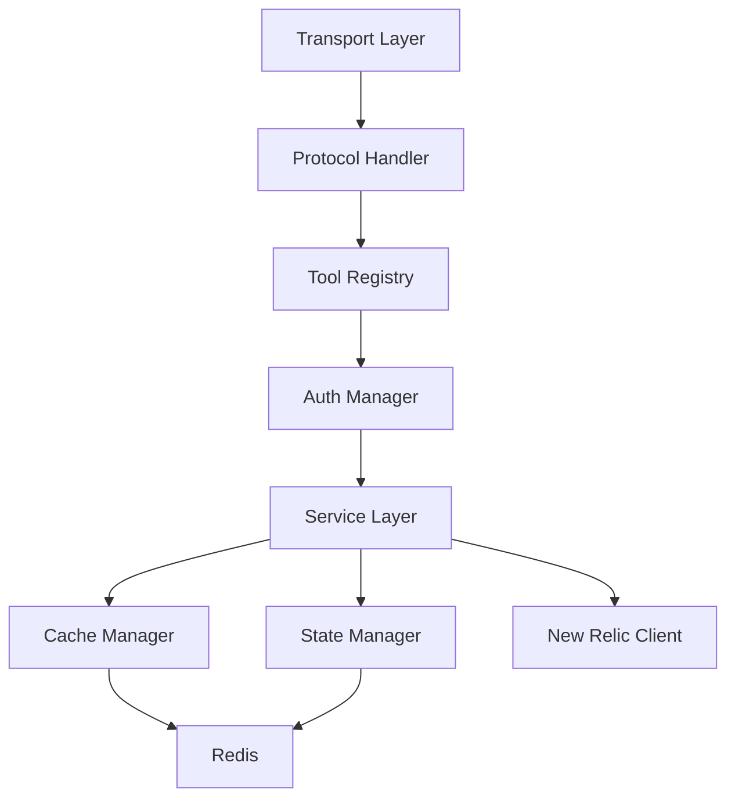

# Architecture Overview

This document specifies the system architecture of the New Relic MCP Server, defining its components, interactions, and design principles.

## Table of Contents

1. [System Architecture](#system-architecture)
2. [Core Components](#core-components)
3. [Service Layer](#service-layer)
4. [Infrastructure Layer](#infrastructure-layer)
5. [External Integrations](#external-integrations)
6. [Data Flow](#data-flow)
7. [Deployment Architecture](#deployment-architecture)
8. [Design Principles](#design-principles)
9. [Scalability Considerations](#scalability-considerations)
10. [Future Architecture](#future-architecture)

## System Architecture

The MCP Server SHALL implement a layered architecture that separates concerns and enables modular development.

```
┌─────────────────────────────────────────────────────────────┐
│                    Client Layer                              │
│         (Claude Desktop, CLI, Web Applications)              │
└─────────────────────────────────────────────────────────────┘
                               │
                               ▼
┌─────────────────────────────────────────────────────────────┐
│                  Transport Layer                             │
│              (STDIO │ HTTP │ SSE)                           │
├─────────────────────────────────────────────────────────────┤
│                 Protocol Handler                             │
│            (JSON-RPC 2.0 + MCP Extensions)                  │
├─────────────────────────────────────────────────────────────┤
│                   Tool Registry                              │
│         (Dynamic Tool Registration & Discovery)              │
├─────────────────────────────────────────────────────────────┤
│                  Service Layer                               │
│  ┌────────────┬─────────────┬────────────┬───────────────┐ │
│  │ Discovery  │   Query     │  Analysis  │  Governance   │ │
│  │  Engine    │  Engine     │  Engine    │   Engine      │ │
│  └────────────┴─────────────┴────────────┴───────────────┘ │
├─────────────────────────────────────────────────────────────┤
│               Infrastructure Layer                           │
│  ┌────────────┬─────────────┬────────────┬───────────────┐ │
│  │   Auth     │   State     │   Cache    │   Telemetry   │ │
│  │  Manager   │  Manager    │  Manager   │    Manager     │ │
│  └────────────┴─────────────┴────────────┴───────────────┘ │
├─────────────────────────────────────────────────────────────┤
│                 Integration Layer                            │
│  ┌────────────────────────┬──────────────────────────────┐ │
│  │    New Relic Client    │      External Services        │ │
│  │    (API + NRDB)        │      (Redis, etc.)           │ │
│  └────────────────────────┴──────────────────────────────┘ │
└─────────────────────────────────────────────────────────────┘
```

## Core Components

### Transport Layer

The Transport Layer SHALL provide protocol-agnostic communication channels between clients and the MCP server.

#### STDIO Transport
- **Purpose**: Direct process communication for embedded scenarios
- **Protocol**: Line-delimited JSON-RPC 2.0 over standard I/O
- **Use Cases**: Claude Desktop integration, CLI tools
- **Characteristics**: 
  - Synchronous request/response
  - No network overhead
  - Process lifecycle management

#### HTTP Transport
- **Purpose**: Network-accessible API for web integrations
- **Protocol**: JSON-RPC 2.0 over HTTP POST
- **Use Cases**: Web applications, service integrations
- **Characteristics**:
  - RESTful endpoints at `/api/v1/jsonrpc`
  - CORS support for browser clients
  - Stateless request handling

#### SSE Transport
- **Purpose**: Server-sent events for streaming operations
- **Protocol**: JSON-RPC 2.0 notifications over SSE
- **Use Cases**: Real-time updates, progress monitoring
- **Characteristics**:
  - Unidirectional server-to-client streaming
  - Automatic reconnection handling
  - Event-based message delivery

### Protocol Handler

The Protocol Handler SHALL implement the JSON-RPC 2.0 specification with MCP-specific extensions.

#### Responsibilities
1. **Message Parsing**: Validate and parse incoming JSON-RPC messages
2. **Request Routing**: Route method calls to appropriate tool handlers
3. **Response Formatting**: Format responses according to JSON-RPC 2.0
4. **Error Handling**: Standardize error responses with MCP error codes
5. **Batch Support**: Process batch requests atomically

#### Message Flow
```
Request → Validate → Route → Execute → Format → Response
           ↓          ↓        ↓         ↓
         Error     Not Found  Error   Error
```

### Tool Registry

The Tool Registry SHALL maintain a dynamic catalog of available tools and their metadata.

#### Components
1. **Tool Catalog**: In-memory registry of tool definitions
2. **Parameter Validator**: JSON Schema validation for tool inputs
3. **Handler Map**: Function pointers to tool implementations
4. **Metadata Store**: Tool descriptions, examples, and categories

#### Tool Definition Structure
```go
type Tool struct {
    Name          string              // Unique identifier
    Description   string              // Human-readable description
    Category      string              // Organizational category
    Parameters    JSONSchema          // Input parameter schema
    Handler       ToolHandler         // Execution function
    Streaming     bool                // Supports streaming responses
    Metadata      ToolMetadata        // Additional guidance
}
```

## Service Layer

The Service Layer SHALL implement the core business logic through specialized engines.

### Discovery Engine

**Specification**: The Discovery Engine SHALL provide schema exploration and data profiling capabilities.

#### Responsibilities
1. **Schema Discovery**: Enumerate available event types and structures
2. **Attribute Profiling**: Analyze attribute characteristics and distributions
3. **Relationship Detection**: Identify correlations between data sources
4. **Quality Assessment**: Evaluate data completeness and reliability
5. **Pattern Recognition**: Detect recurring patterns in data

#### Interfaces
```go
type DiscoveryEngine interface {
    DiscoverSchemas(ctx context.Context, filter DiscoveryFilter) ([]Schema, error)
    ProfileSchema(ctx context.Context, name string, depth ProfileDepth) (*Schema, error)
    FindRelationships(ctx context.Context, schemas []Schema) ([]Relationship, error)
    AssessQuality(ctx context.Context, schema string) (*QualityReport, error)
}
```

### Query Engine

**Specification**: The Query Engine SHALL execute NRQL queries with optimization and adaptation capabilities.

#### Responsibilities
1. **Query Execution**: Execute NRQL queries against New Relic
2. **Query Validation**: Validate syntax and permissions before execution
3. **Query Optimization**: Apply performance optimizations
4. **Result Caching**: Cache results based on query patterns
5. **Adaptive Execution**: Adjust execution strategy based on data volume

### Analysis Engine

**Specification**: The Analysis Engine SHALL provide statistical analysis and pattern detection.

#### Capabilities
1. **Baseline Calculation**: Statistical baseline determination
2. **Anomaly Detection**: Identify deviations from normal patterns
3. **Correlation Analysis**: Find relationships between metrics
4. **Trend Analysis**: Detect and forecast trends
5. **Distribution Analysis**: Characterize data distributions

### Governance Engine

**Specification**: The Governance Engine SHALL manage platform usage, costs, and compliance.

#### Functions
1. **Usage Tracking**: Monitor data ingestion and query volumes
2. **Cost Analysis**: Calculate and project platform costs
3. **Compliance Checking**: Verify adherence to policies
4. **Optimization Recommendations**: Suggest cost-saving measures
5. **Audit Trail**: Maintain activity logs

## Infrastructure Layer

The Infrastructure Layer SHALL provide cross-cutting concerns and foundational services.

### Authentication Manager

**Specification**: The Authentication Manager SHALL handle credential validation and session management.

#### Components
1. **API Key Validator**: Validate New Relic API keys
2. **JWT Manager**: Generate and validate JWT tokens
3. **Session Store**: Maintain active sessions
4. **Permission Checker**: Verify operation permissions

### State Manager

**Specification**: The State Manager SHALL provide distributed state management across server instances.

#### Storage Backends
1. **Memory Store**: In-process storage for single instances
2. **Redis Store**: Distributed storage for multi-instance deployments

#### State Types
- **Session State**: User session information
- **Cache State**: Cached query and discovery results
- **Discovery State**: Schema and profiling information
- **Workflow State**: Multi-step operation context

### Cache Manager

**Specification**: The Cache Manager SHALL implement multi-layer caching with intelligent invalidation.

#### Cache Layers
```
L1: Request Cache (TTL: seconds)
    ↓
L2: Memory Cache (TTL: minutes)
    ↓
L3: Distributed Cache (TTL: hours)
    ↓
L4: Persistent Cache (TTL: days)
```

#### Invalidation Strategy
1. **TTL-based**: Automatic expiration
2. **Event-based**: Invalidate on data changes
3. **Manual**: Explicit cache clearing
4. **Cascade**: Dependent cache invalidation

### Telemetry Manager

**Specification**: The Telemetry Manager SHALL provide observability for the MCP server itself.

#### Components
1. **Metrics Collector**: Prometheus-compatible metrics
2. **Trace Manager**: Distributed tracing support
3. **Log Aggregator**: Structured logging pipeline
4. **Health Monitor**: Service health checks

## External Integrations

### New Relic Client

The New Relic Client SHALL provide abstracted access to New Relic APIs.

#### Interfaces
1. **NRDB Client**: Query execution against NRDB
2. **GraphQL Client**: Entity and configuration queries
3. **REST Client**: Alert and dashboard management
4. **Streaming Client**: Real-time data access

#### Features
- **Connection Pooling**: Efficient connection management
- **Rate Limiting**: Respect API rate limits
- **Retry Logic**: Exponential backoff for transient failures
- **Multi-Region**: Support for US and EU datacenters

## Data Flow

### Request Processing Flow

```
1. Client Request
    ↓
2. Transport Layer (Protocol Decoding)
    ↓
3. Protocol Handler (Validation & Routing)
    ↓
4. Tool Registry (Handler Lookup)
    ↓
5. Authentication (Permission Check)
    ↓
6. Cache Check (Return if Hit)
    ↓
7. Service Layer (Business Logic)
    ↓
8. External Services (New Relic API)
    ↓
9. Cache Update
    ↓
10. Response Formatting
    ↓
11. Client Response
```

### Discovery Flow

```
1. Schema Discovery Request
    ↓
2. Cache Check (Return if Fresh)
    ↓
3. NRDB Metadata Query
    ↓
4. Parallel Attribute Analysis
    ↓
5. Pattern Detection
    ↓
6. Quality Assessment
    ↓
7. Cache Update
    ↓
8. Response with Insights
```

## Deployment Architecture

### Single Instance Deployment

```
┌─────────────────┐
│   MCP Server    │
│  ┌───────────┐  │
│  │  Memory   │  │
│  │   Cache   │  │
│  └───────────┘  │
└────────┬────────┘
         │
    ┌────┴────┐
    │   New   │
    │  Relic  │
    └─────────┘
```

### Multi-Instance Deployment

```
     Load Balancer
          │
    ┌─────┴─────┬─────────┐
    ▼           ▼         ▼
┌─────────┐ ┌─────────┐ ┌─────────┐
│  MCP    │ │  MCP    │ │  MCP    │
│ Server  │ │ Server  │ │ Server  │
└────┬────┘ └────┬────┘ └────┬────┘
     │           │           │
     └─────┬─────┴─────┬─────┘
           ▼           ▼
      ┌────────┐  ┌─────────┐
      │ Redis  │  │   New   │
      │ Cache  │  │  Relic  │
      └────────┘  └─────────┘
```

## Design Principles

### 1. Discovery-First Architecture
- **Principle**: Never assume data structures; always discover
- **Implementation**: All operations start with schema discovery
- **Benefit**: Adapts to any New Relic account configuration

### 2. Layered Architecture
- **Principle**: Separate concerns into distinct layers
- **Implementation**: Clear boundaries between transport, business logic, and data
- **Benefit**: Modularity and maintainability

### 3. Tool Composability
- **Principle**: Simple tools that compose into complex workflows
- **Implementation**: Each tool does one thing well
- **Benefit**: Flexible and powerful combinations

### 4. Fail-Safe Design
- **Principle**: Graceful degradation over complete failure
- **Implementation**: Fallbacks, caching, and partial results
- **Benefit**: Resilient user experience

### 5. Performance by Design
- **Principle**: Optimize for common use cases
- **Implementation**: Multi-layer caching, query optimization
- **Benefit**: Low latency and efficient resource usage

## Scalability Considerations

### Horizontal Scaling
- **Stateless Design**: Servers can be added/removed dynamically
- **Distributed State**: Redis enables shared state across instances
- **Load Distribution**: Round-robin or least-connections routing

### Vertical Scaling
- **Resource Pools**: Configurable worker pools and connection limits
- **Memory Management**: Bounded caches with eviction policies
- **CPU Optimization**: Parallel processing for independent operations

### Performance Optimization
- **Query Batching**: Combine multiple queries when possible
- **Result Streaming**: Stream large results to avoid memory pressure
- **Adaptive Timeouts**: Adjust timeouts based on operation complexity

## Future Architecture

### Planned Enhancements

#### 1. Plugin System
```
┌─────────────────────────────────┐
│         Plugin Manager          │
├─────────┬───────────┬───────────┤
│ Custom  │  Third    │ Community │
│ Tools   │  Party    │  Tools    │
└─────────┴───────────┴───────────┘
```

#### 2. Event-Driven Architecture
- **Event Bus**: Decouple components through events
- **Webhooks**: External event notifications
- **Real-time Sync**: Push-based data updates

#### 3. Advanced Caching
- **Predictive Cache**: Pre-warm based on usage patterns
- **Distributed Cache**: Geo-distributed caching
- **Smart Invalidation**: ML-based cache management

#### 4. Multi-Tenant Architecture
- **Account Isolation**: Complete data separation
- **Resource Quotas**: Per-tenant resource limits
- **Custom Configurations**: Tenant-specific settings

### Technology Considerations

#### Language and Runtime
- **Current**: Go 1.21+ for performance and concurrency
- **Future**: Consider Rust for critical path components

#### Dependencies
- **Minimized**: Core functionality with minimal dependencies
- **Vendored**: Dependency vendoring for reproducibility
- **Security**: Regular dependency scanning and updates

## Security Architecture

### Defense in Depth
1. **Network Layer**: TLS encryption, firewall rules
2. **Application Layer**: Input validation, rate limiting
3. **Data Layer**: Encryption at rest, access controls
4. **Audit Layer**: Comprehensive logging and monitoring

### Zero Trust Principles
- **Verify Always**: Authenticate every request
- **Least Privilege**: Minimal required permissions
- **Assume Breach**: Design for compromise containment

## Monitoring and Observability

### Metrics
The system SHALL expose Prometheus-compatible metrics:

```
# Request metrics
mcp_requests_total{method, transport, status}
mcp_request_duration_seconds{method, transport}

# Tool metrics
mcp_tool_executions_total{tool, status}
mcp_tool_duration_seconds{tool}

# Cache metrics
mcp_cache_hits_total{cache_level}
mcp_cache_misses_total{cache_level}

# Resource metrics
mcp_active_connections{transport}
mcp_memory_usage_bytes
```

### Logging
Structured logging with contextual information:

```json
{
  "timestamp": "2024-01-20T10:30:00Z",
  "level": "info",
  "request_id": "req-123",
  "user_id": "user-456",
  "method": "discovery.explore_event_types",
  "duration_ms": 245,
  "status": "success"
}
```

### Tracing
Distributed tracing for request flow visualization:
- **Trace Context**: Propagate trace IDs across services
- **Span Attributes**: Capture operation details
- **Sampling**: Configurable sampling rates

## Component Dependencies



## Related Documentation

- [Discovery-First Architecture](11_ARCHITECTURE_DISCOVERY_FIRST.md) - Deep dive into discovery principles
- [State Management](12_ARCHITECTURE_STATE_MANAGEMENT.md) - Detailed state architecture
- [Transport Layers](13_ARCHITECTURE_TRANSPORT_LAYERS.md) - Transport protocol specifications
- [Security Architecture](14_ARCHITECTURE_SECURITY.md) - Security design details
- [API Reference](20_API_OVERVIEW.md) - Complete API documentation

---

**Architecture Decisions**: For detailed rationale behind architectural choices, see [Architecture Decision Records](19_ARCHITECTURE_DECISIONS.md).