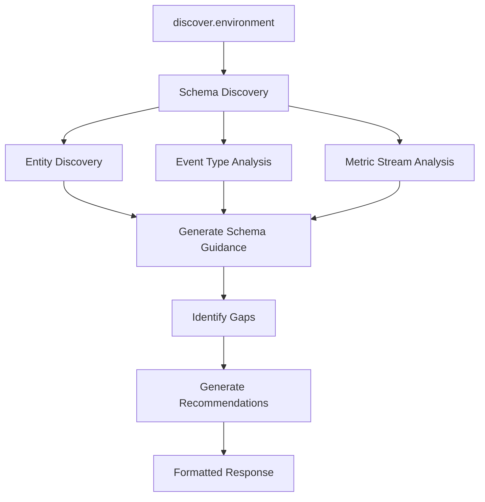
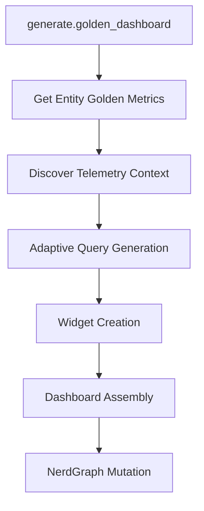
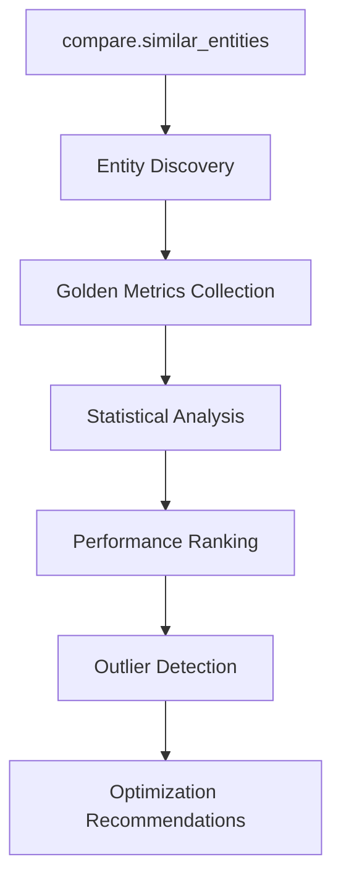

# Discovery-First Design Philosophy

The Enhanced MCP Server New Relic implements a "discover-first, assume-nothing" philosophy that eliminates hardcoded schemas and adapts to any New Relic environment.

## Core Principles

### 1. Zero Hardcoded Schemas

**Problem**: Traditional observability tools assume specific schemas, breaking when customers use different instrumentation approaches.

**Solution**: Dynamic discovery of all available telemetry before making any assumptions.

```typescript
// Instead of hardcoded assumptions:
// SELECT average(duration) FROM Transaction WHERE appName = 'myapp'

// We discover first:
const context = await goldenSignals.analyzeTelemetryContext(accountId);
const query = context.hasOpenTelemetry
  ? `SELECT average(duration.ms) FROM Span WHERE ${context.serviceIdentifierField} = 'myapp' AND span.kind = 'server'`
  : `SELECT average(duration) * 1000 FROM Transaction WHERE ${context.serviceIdentifierField} = 'myapp'`;
```

### 2. OpenTelemetry vs APM Intelligence

**Automatic Detection**: The system automatically detects whether an environment uses:
- OpenTelemetry instrumentation (Span events)
- New Relic APM agents (Transaction events)
- Mixed environments (both)

**Adaptive Queries**: All tools automatically generate optimal queries based on detected instrumentation.

```typescript
export interface TelemetryContext {
  hasOpenTelemetry: boolean;
  hasNewRelicAPM: boolean;
  primaryDataSource: 'otel' | 'apm' | 'mixed';
  serviceIdentifierField: string; // 'service.name' vs 'appName'
  eventTypes: string[];
  confidence: number;
}
```

### 3. Schema Discovery Process

**Step 1: Event Type Discovery**
```sql
SHOW EVENT TYPES SINCE 1 week ago
```

**Step 2: Attribute Profiling**
```sql
SELECT keyset() FROM {EventType} SINCE 24 hours ago LIMIT 1
```

**Step 3: Service Identification**
```sql
-- Check for OpenTelemetry
SELECT uniques(service.name) FROM Span LIMIT 10

-- Check for APM
SELECT uniques(appName) FROM Transaction LIMIT 10
```

**Step 4: Volume Analysis**
```sql
SELECT count(*) FROM {EventType} SINCE 1 hour ago
```

## Discovery Components

### Platform Discovery Engine (`PlatformDiscovery`)

Core discovery engine that profiles the observability environment:

**Capabilities:**
- Event type discovery with volume analysis
- Attribute profiling and pattern detection
- Service identifier field detection
- Error pattern analysis
- Metric stream categorization

**Caching Strategy:**
- Schemas: 4 hours TTL (change rarely)
- Attributes: 30 minutes TTL (change more often)
- Service IDs: 2 hours TTL (stable)
- Error patterns: 30 minutes TTL (dynamic)

### Golden Signals Engine (`GoldenSignalsEngine`)

Intelligent analysis of the four golden signals with telemetry awareness:

**Discovery Process:**
1. **Telemetry Context Analysis**: Determines OTEL vs APM
2. **Latency Discovery**: Finds optimal duration fields
3. **Traffic Discovery**: Identifies request rate patterns
4. **Error Discovery**: Locates error indicators
5. **Saturation Discovery**: Finds resource utilization metrics

**Analytical Metadata:**
```typescript
export interface AnalyticalMetadata {
  dataQuality: {
    completeness: number; // 0-1 scale
    consistency: number;
    volumeStability: 'stable' | 'increasing' | 'decreasing' | 'volatile';
    lastDataPoint: Date;
  };
  seasonality: {
    detected: boolean;
    pattern?: 'daily' | 'weekly' | 'monthly';
    confidence: number;
  };
  anomalies: {
    detected: boolean;
    type?: 'spike' | 'drop' | 'trend_change' | 'outlier';
    severity: 'low' | 'medium' | 'high' | 'critical';
  };
}
```

### Environment Discovery Tool (`EnvironmentDiscoveryTool`)

Composite tool providing complete environment awareness in one call:

**Discovery Scope:**
- Monitored entities with health status
- Available event types with volume metrics
- Metric streams with categorization
- Schema guidance for optimal queries
- Observability gaps and recommendations

**Output Format:**
```typescript
export interface EnvironmentSnapshot {
  entities: EntitySummary[];
  eventTypes: EventTypeSummary[];
  metricStreams: MetricStreamSummary[];
  schemaHints: SchemaGuidance;
  telemetryContext: TelemetryContext;
  observabilityGaps: string[];
  recommendations: string[];
}
```

## Discovery-First Workflows

### 1. Environment Assessment Workflow



### 2. Dashboard Generation Workflow



### 3. Entity Comparison Workflow



## Benefits of Discovery-First

### 1. Universal Compatibility

**Works with any instrumentation approach:**
- Pure OpenTelemetry environments
- Legacy New Relic APM setups
- Mixed instrumentation environments
- Custom telemetry implementations

### 2. Intelligent Adaptation

**Query optimization based on actual data:**
- Uses `duration.ms` for OTEL Span events
- Uses `duration * 1000` for APM Transaction events
- Prefers `service.name` for OTEL, `appName` for APM
- Adapts error detection to available fields

### 3. Proactive Gap Identification

**Identifies missing observability:**
- Lack of error tracking
- Missing infrastructure monitoring
- Incomplete log correlation
- Limited golden signals coverage

### 4. Future-Proof Architecture

**Adapts to changes automatically:**
- New event types discovered dynamically
- Schema changes handled gracefully
- Mixed environments supported
- Custom telemetry integrated seamlessly

## Implementation Details

### Discovery Cache Strategy

```typescript
const DISCOVERY_CACHE_CONFIG = {
  schemas: 4 * 60 * 60 * 1000,      // 4 hours - schemas change rarely
  attributes: 30 * 60 * 1000,       // 30 minutes - attributes change more often
  serviceId: 2 * 60 * 60 * 1000,    // 2 hours - service identifiers stable
  errors: 30 * 60 * 1000,           // 30 minutes - error patterns change
};
```

### Confidence Scoring

**Discovery confidence based on:**
- Data volume and consistency
- Attribute completeness
- Schema stability
- Query success rates

```typescript
interface DiscoveryConfidence {
  overall: number; // 0-1 scale
  telemetryDetection: number;
  schemaStability: number;
  dataQuality: number;
}
```

### Error Handling Strategy

**Graceful degradation:**
- Return partial results when some discovery fails
- Provide helpful error messages with suggestions
- Fall back to cached data when API calls fail
- Include confidence indicators in responses

## Schema Guidance Output

Discovery generates concrete guidance for optimal queries:

```typescript
export interface SchemaGuidance {
  serviceIdentifierField: string; // 'service.name' or 'appName'
  preferredQueryPatterns: {
    latency: string;    // Optimal latency query pattern
    throughput: string; // Optimal throughput query pattern
    errors: string;     // Optimal error query pattern
  };
  goldenSignalStrategy: string; // High-level strategy description
  instrumentationNotes: string[]; // Implementation-specific notes
}
```

**Example Output:**
```markdown
## Schema Guidance for Queries

**Service Identifier**: Use `service.name` to filter by service

**Golden Signal Queries**:
- **Latency**: `percentile(duration.ms, 95) FROM Span WHERE span.kind = "server"`
- **Throughput**: `rate(count(*), 1 minute) FROM Span WHERE span.kind = "server"`
- **Errors**: `filter(count(*), WHERE otel.status_code = "ERROR") FROM Span`

**Strategy**: Use Span events for golden signals (span.kind = "server" for entry spans)
```

## Best Practices

### 1. Always Discover First

**Before any NRQL query or dashboard creation:**
```typescript
// ✅ Good: Discover first
const snapshot = await environmentTool.handle({});
// Use snapshot.schemaHints for optimal queries

// ❌ Bad: Assume schema
const query = "SELECT average(duration) FROM Transaction WHERE appName = 'myapp'";
```

### 2. Cache Discovery Results

**Use intelligent caching to avoid repeated discovery:**
```typescript
const cached = cache.get(`discovery-${accountId}`);
if (cached && !isStale(cached.timestamp)) {
  return cached.data;
}
```

### 3. Include Confidence Indicators

**Always communicate discovery confidence:**
```typescript
if (telemetryContext.confidence < 0.7) {
  recommendations.push('Limited telemetry detected - consider improving instrumentation');
}
```

### 4. Provide Actionable Guidance

**Include specific next steps:**
```typescript
if (!hasErrorTracking) {
  recommendations.push('Enable error tracking in your application instrumentation');
}
```

---

**Next**: [31_TOOLS_COMPOSITE.md](31_TOOLS_COMPOSITE.md) for composite tools deep dive