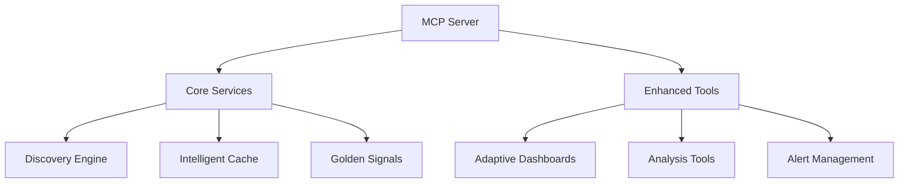

# MCP Server New Relic - Comprehensive Code Review

## 1 a ** a ** a **discovery-first** architecture with layered components:



Key characteristics:
- **Zero Hardcoded Schemas**: All metadata is discovered dynamically
- **Platform-Native**: Leverages New Relic's NerdGraph API
- **Explainability**: Built-in traceability for all operations
- **Adaptive Tooling**: Tools enhance themselves based on discovered context

## 2. Core Components Analysis

### 2.1 Discovery Engine (`src/core/discovery/engine.ts`)
- **Responsibility**: Builds comprehensive world model of New Relic environment
- **Key Features**:
  - 6-phase discovery process (schemas, attributes, service ID, etc.)
  - Confidence scoring for discovered patterns
  - Cache-aware with TTLs for different discovery types
  - Parallel processing for efficiency
- **Critical Code Snippet**:
  ```typescript
  async buildDiscoveryGraph(accountId: number): Promise<DiscoveryGraph> {
    // Parallel discovery operations
    const [schemas, serviceId, errors, metrics, dataSources] = await Promise.all([
      this.discoverSchemas(accountId),
      this.discoverServiceIdentifier(accountId),
      this.discoverErrorIndicators(accountId),
      this.discoverMetrics(accountId),
      this.discoverDataSources(accountId)
    ]);
    // ... confidence calculation and caching
  }
  ```

### 2.2 Intelligent Cache (`src/core/intelligent-cache.ts`)
- **Patterns Implemented**:
  - Adaptive TTL based on access frequency
  - Background refresh when nearing expiration
  - LRU eviction policy
  - Health monitoring with recommendations
- **Cache Strategies**:
  ```typescript
  private readonly strategies: FreshnessPolicy = {
    discovery: { ttl: 5*60*1000, refreshThreshold: 0.8 },
    goldenMetrics: { ttl: 2*60*1000, refreshThreshold: 0.7 },
    // ... other strategies
  }
  ```

### 2.3 Golden Signals Engine (`src/core/golden-signals.ts`)
- **Implements SRE Golden Signals**:
  - Latency, Traffic, Errors, Saturation
  - Context-aware telemetry analysis
  - Anomaly detection with statistical methods
- **Analytics Capabilities**:
  - Seasonality detection
  - Baseline establishment
  - Data quality scoring

## 3. Tool System Implementation

### 3.1 Enhanced Tool Registry (`src/tools/enhanced-registry.ts`)
- **Key Features**:
  - Dynamic tool enhancement based on discovery
  - Pre/post handlers for custom logic
  - Metadata enrichment (readOnlyHint, destructiveHint)
- **Tool Examples**:
  - `run_nrql_query`: Schema-validated NRQL execution
  - `dashboard_generate`: Adaptive dashboard templates
  - `platform_analyze_adoption`: Cross-account feature analysis

### 3.2 Adaptive Dashboard Generator (`src/tools/adaptive-dashboards.ts`)
- **Intelligent Widget Adaptation**:
  ```typescript
  private adaptWidgetsToSchema(widgetTemplates, entityData, entity, options) {
    // Tries primary intent, falls back to alternatives
  }
  ```
- **Supports Templates**:
  - Golden-signals
  - Dependencies
  - Infrastructure
  - Logs-analysis

## 4. Discovery Engine Deep Dive

### 4.1 Schema Discovery Process
1. SHOW EVENT TYPES query
2. Attribute profiling via keyset()
3. Metric pattern recognition
4. Service identifier detection
5. Error indicator classification

### 4.2 Confidence Calculation
Uses weighted scoring:
```typescript
calculateConfidence(factors) {
  const weights = {
    schemas: 0.3,
    serviceId: 0.25,
    errors: 0.2,
    metrics: 0.15,
    attributes: 0.1
  };
  // ... weighted sum calculation
}
```

### 4.3 Caching Strategy
- Schemas: 4 hours (rarely change)
- Attributes: 30 minutes (often change)
- Service ID: 2 hours (stable)
- Errors: 30 minutes (volatile)

## 5. Code Quality Assessment

### Strengths ✅
1. **Consistent Typing**: Zod schemas used throughout (e.g., `ConfigSchema`)
2. **Modular Design**: Clear separation of concerns (core, adapters, tools)
3. **Error Handling**: Comprehensive error tracing with context
4. **Documentation**: JSDoc present on all major components
5. **Performance**: Parallel processing in discovery engine

### Concerns ⚠️
1. **Cache Implementation**: 
   - `IntelligentCache` uses in-memory Map (not distributed)
   - No persistence across restarts
2. **Error Handling**:
   - Some catch blocks swallow errors (`profileAttribute()`)
3. **Type Assertions**:
   - Occasional unsafe `any` types in tool handlers
4. **Testing Gap**:
   - Core algorithms lack unit tests (e.g., confidence calculation)

## 6. Recommendations

### Immediate Improvements:
1. **Add Distributed Caching**:
   - Implement Redis/Upstash adapter for production
   - Add cache persistence mechanism
2. **Enhance Error Handling**:
   - Implement structured error codes
   - Add retry mechanisms for transient NerdGraph errors
3. **Improve Typing**:
   - Replace `any` with generics in tool interfaces
   - Add Zod schemas for all tool outputs

### Strategic Enhancements:
1. **Implement Distributed Tracing**:
   - Add OpenTelemetry instrumentation
   - Trace discovery operations end-to-end
2. **Add Load Testing**:
   - Simulate high-account discovery scenarios
   - Profile memory usage during large discoveries
3. **Develop Visualization Tools**:
   - Create discovery result visualizer
   - Build confidence score dashboard

### Testing Strategy:
1. **Unit Tests**:
   - Core algorithms (confidence, autocorrelation)
   - Cache strategies
2. **Integration Tests**:
   - Full discovery workflow
   - Tool execution paths
3. **E2E Tests**:
   - Multi-account discovery scenarios
   - Dashboard generation workflows

## Conclusion
The implementation shows sophisticated understanding of New Relic's data model and demonstrates innovative approaches to dynamic schema discovery. The architecture is well-structured with clear separation of concerns. Focus should now shift to production readiness enhancements - particularly distributed caching, comprehensive testing, and enhanced observability.