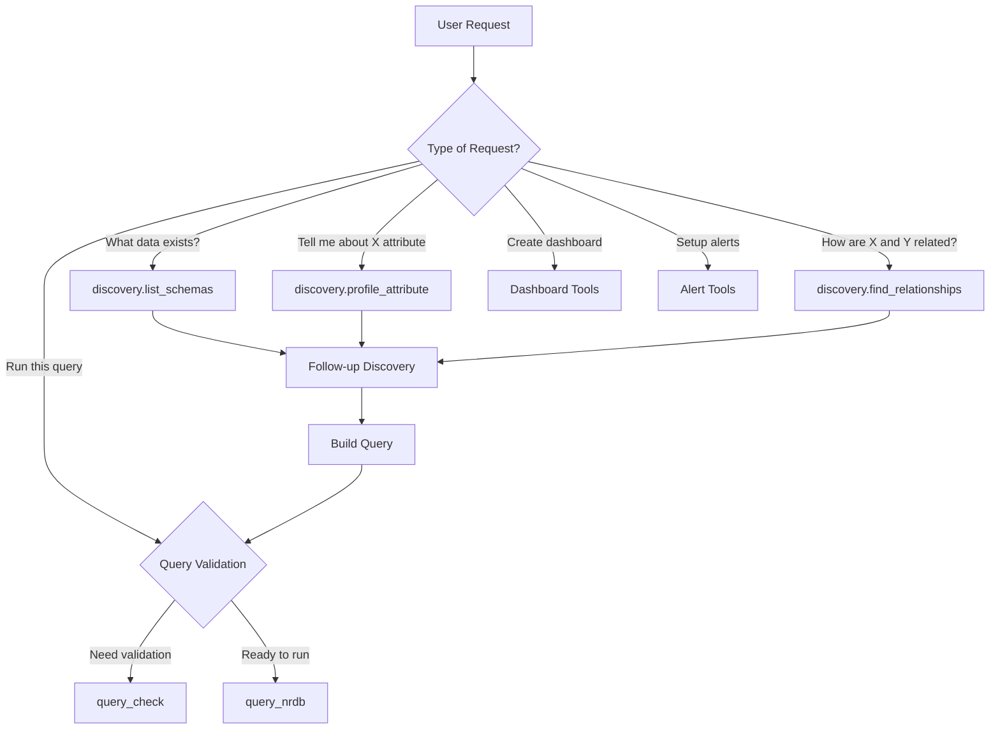

# LLM Integration Guide for New Relic MCP Server

This guide provides comprehensive instructions for integrating AI assistants with the New Relic MCP Server, optimizing their behavior, and ensuring safe, efficient operations.

## Table of Contents

1. [Integration Overview](#integration-overview)
2. [Prompt Engineering Best Practices](#prompt-engineering-best-practices)
3. [Tool Selection Strategies](#tool-selection-strategies)
4. [Error Handling and Recovery](#error-handling-and-recovery)
5. [Safety Guidelines and Rate Limiting](#safety-guidelines-and-rate-limiting)
6. [Example Conversations](#example-conversations)
7. [CLAUDE.md Template](#claudemd-template)
8. [Performance Optimization](#performance-optimization)
9. [Troubleshooting](#troubleshooting)

## Integration Overview

### Supported AI Assistants

#### Claude (Anthropic)
```bash
# Claude Desktop integration
{
  "mcpServers": {
    "newrelic": {
      "command": "/path/to/mcp-server-newrelic",
      "env": {
        "NEW_RELIC_API_KEY": "your-api-key",
        "NEW_RELIC_ACCOUNT_ID": "your-account-id"
      }
    }
  }
}
```

#### GPT (OpenAI)
```python
# Custom GPT Action Schema
{
  "openapi": "3.0.0",
  "info": {
    "title": "New Relic MCP Server",
    "version": "1.0.0"
  },
  "servers": [
    {
      "url": "http://localhost:3000/mcp"
    }
  ],
  "paths": {
    "/tools/{toolName}": {
      "post": {
        "operationId": "executeTool",
        "parameters": [
          {
            "name": "toolName",
            "in": "path",
            "required": true,
            "schema": {
              "type": "string"
            }
          }
        ]
      }
    }
  }
}
```

#### Other LLMs (LangChain Integration)
```python
from langchain.tools import Tool
from mcp_client import MCPClient

# Initialize MCP client
mcp = MCPClient("localhost:3000")

# Create LangChain tools
tools = [
    Tool(
        name=tool.name,
        description=tool.description,
        func=lambda params: mcp.execute(tool.name, params)
    )
    for tool in mcp.list_tools()
]
```

### Architecture Overview

```
┌─────────────────────┐     ┌─────────────────────┐
│   AI Assistant      │     │   AI Assistant      │
│   (Claude)          │     │   (GPT/Other)       │
└──────────┬──────────┘     └──────────┬──────────┘
           │                           │
           │ MCP Protocol              │ HTTP/REST
           │                           │
           ▼                           ▼
┌─────────────────────────────────────────────────┐
│              MCP Server Gateway                  │
├─────────────────────────────────────────────────┤
│  Discovery Engine → Query Tools → Workflows     │
└─────────────────────────────────────────────────┘
                       │
                       ▼
                New Relic APIs
```

## Prompt Engineering Best Practices

### Discovery-First Approach

The discovery-first approach ensures AI assistants understand the data landscape before executing queries:

```markdown
# System Prompt Template

You are an AI assistant with access to New Relic observability data through the MCP server. 
Follow these principles:

1. **Always Start with Discovery**
   - Use discovery.list_schemas first to understand available data
   - Profile attributes before using them in queries
   - Check relationships between data types

2. **Progressive Refinement**
   - Start with simple queries
   - Use query_check to validate before execution
   - Refine based on results and discovery insights

3. **Context Awareness**
   - Maintain awareness of discovered schemas
   - Reference previous discoveries in conversations
   - Build mental models of the data landscape
```

### Effective System Instructions

```markdown
## Core Behaviors

1. **Discovery Before Action**
   ```
   User: "Show me slow transactions"
   Assistant: Let me first discover what transaction data is available...
   [Uses discovery.list_schemas]
   [Uses discovery.profile_attribute on relevant fields]
   [Then builds appropriate query]
   ```

2. **Validate Before Execute**
   ```
   Before running any NRQL query:
   1. Use query_check to validate syntax
   2. Review estimated data usage
   3. Confirm query aligns with user intent
   ```

3. **Explain Your Process**
   ```
   Always explain:
   - What you're discovering and why
   - How discoveries inform your queries
   - What the results mean in context
   ```
```

### Context Management

```markdown
## Maintaining Context Across Conversations

1. **Schema Cache**
   - Remember discovered schemas within session
   - Reference previous discoveries
   - Build cumulative understanding

2. **Query History**
   - Track successful query patterns
   - Learn from query refinements
   - Suggest optimizations based on history

3. **User Intent Tracking**
   - Understand investigation goals
   - Connect related queries
   - Suggest next steps based on findings
```

## Tool Selection Strategies

### Decision Tree for Tool Selection



### Tool Categories and Use Cases

#### Discovery Tools
```yaml
discovery.list_schemas:
  when: Starting investigation, understanding data landscape
  example: "What telemetry data do we have?"
  
discovery.profile_attribute:
  when: Need details about specific fields
  example: "What values does 'error.class' contain?"
  
discovery.find_relationships:
  when: Connecting different data types
  example: "How do transactions relate to logs?"
  
discovery.assess_quality:
  when: Evaluating data reliability
  example: "Is our APM data complete?"
```

#### Query Tools
```yaml
query_check:
  when: Before executing any query
  example: Validate syntax, check permissions
  
query_nrdb:
  when: Retrieving actual data
  example: "SELECT * FROM Transaction WHERE duration > 1"
  
query_builder:
  when: Constructing complex queries programmatically
  example: Building queries from discovered attributes
```

#### Dashboard Tools
```yaml
find_usage:
  when: Understanding existing dashboards
  example: "Which dashboards use 'cpu.usage'?"
  
generate_dashboard:
  when: Creating new visualizations
  example: "Create an SLO dashboard"
  
list_dashboards:
  when: Browsing dashboard inventory
  example: "Show me performance dashboards"
```

#### Alert Tools
```yaml
create_alert:
  when: Setting up monitoring
  example: "Alert when error rate > 5%"
  
analyze_alerts:
  when: Reviewing alert effectiveness
  example: "Which alerts fire most often?"
  
bulk_update_alerts:
  when: Making mass changes
  example: "Update all CPU alerts to new threshold"
```

### Smart Tool Chaining

```python
# Example: Investigate Performance Issue
workflow = [
    # 1. Discover available data
    ("discovery.list_schemas", {"pattern": "Transaction"}),
    
    # 2. Profile key attributes
    ("discovery.profile_attribute", {
        "entityType": "Transaction",
        "attributeName": "duration"
    }),
    
    # 3. Find related data
    ("discovery.find_relationships", {
        "sourceType": "Transaction",
        "targetTypes": ["TransactionError", "Log"]
    }),
    
    # 4. Build and validate query
    ("query_check", {
        "query": "SELECT percentile(duration, 95) FROM Transaction"
    }),
    
    # 5. Execute query
    ("query_nrdb", {
        "query": "SELECT percentile(duration, 95) FROM Transaction",
        "timeout": 30
    })
]
```

## Error Handling and Recovery

### Common Error Patterns

#### 1. Authentication Errors
```javascript
// Error Response
{
  "error": {
    "code": -32003,
    "message": "Authentication failed",
    "data": {
      "type": "AUTH_ERROR",
      "details": "Invalid API key"
    }
  }
}

// Recovery Strategy
1. Prompt user to check API key configuration
2. Suggest using `make diagnose` to validate setup
3. Offer to work in mock mode if appropriate
```

#### 2. Query Errors
```javascript
// Error Response
{
  "error": {
    "code": -32602,
    "message": "Invalid query syntax",
    "data": {
      "type": "NRQL_SYNTAX_ERROR",
      "line": 1,
      "column": 15,
      "suggestion": "Did you mean 'FROM' instead of 'FORM'?"
    }
  }
}

// Recovery Strategy
1. Use query_check before execution
2. Parse error details and suggest corrections
3. Offer query builder for complex queries
```

#### 3. Rate Limit Errors
```javascript
// Error Response
{
  "error": {
    "code": -32005,
    "message": "Rate limit exceeded",
    "data": {
      "type": "RATE_LIMIT",
      "retryAfter": 60,
      "limit": "100 requests per minute"
    }
  }
}

// Recovery Strategy
1. Implement exponential backoff
2. Cache discovery results
3. Batch operations when possible
```

### Error Recovery Patterns

```python
# Retry with Exponential Backoff
def execute_with_retry(tool, params, max_retries=3):
    for attempt in range(max_retries):
        try:
            return mcp.execute(tool, params)
        except RateLimitError as e:
            if attempt == max_retries - 1:
                raise
            wait_time = min(2 ** attempt, 60)
            time.sleep(wait_time)
        except TransientError:
            if attempt == max_retries - 1:
                raise
            continue
```

```python
# Graceful Degradation
def query_with_fallback(query):
    try:
        # Try full query
        return execute_tool("query_nrdb", {"query": query})
    except TimeoutError:
        # Reduce time range
        simplified = add_time_constraint(query, "SINCE 1 hour ago")
        return execute_tool("query_nrdb", {"query": simplified})
    except PermissionError:
        # Use discovery to find accessible data
        schemas = execute_tool("discovery.list_schemas", {})
        return suggest_alternative_query(query, schemas)
```

## Safety Guidelines and Rate Limiting

### Query Safety

```yaml
# Safe Query Patterns
safe_patterns:
  - Always use LIMIT clause for exploration
  - Add time constraints (SINCE/UNTIL)
  - Validate with query_check first
  - Monitor estimated data usage

# Dangerous Patterns to Avoid
avoid:
  - SELECT * without LIMIT
  - Unbounded time ranges
  - Cartesian joins
  - Recursive subqueries
```

### Rate Limiting Strategy

```python
class RateLimiter:
    def __init__(self):
        self.limits = {
            "query_nrdb": {"calls": 100, "window": 60},
            "discovery.*": {"calls": 50, "window": 60},
            "create_alert": {"calls": 10, "window": 300},
            "bulk_update_alerts": {"calls": 1, "window": 300}
        }
    
    def check_limit(self, tool_name):
        # Implement sliding window rate limiting
        pass
```

### Resource Management

```yaml
# Query Timeouts
timeouts:
  discovery_operations: 10s
  simple_queries: 30s
  complex_queries: 60s
  bulk_operations: 300s

# Result Size Limits
limits:
  max_results: 10000
  max_response_size: 10MB
  max_attributes: 200
  max_relationships: 1000

# Caching Strategy
cache:
  schema_discovery: 5 minutes
  attribute_profiles: 2 minutes
  query_results: 30 seconds
  dashboard_list: 1 minute
```

### Security Best Practices

```markdown
## Security Guidelines

1. **Input Validation**
   - Sanitize all user inputs
   - Validate NRQL syntax before execution
   - Prevent injection attacks

2. **Data Access Control**
   - Respect New Relic permissions
   - Don't bypass access controls
   - Audit sensitive operations

3. **Secret Management**
   - Never log API keys
   - Mask sensitive data in responses
   - Use environment variables for credentials

4. **Audit Trail**
   - Log all tool executions
   - Track query patterns
   - Monitor for anomalies
```

## Example Conversations

### Example 1: Performance Investigation

```markdown
User: Our web app is slow. Can you help investigate?

[Uses discovery.list_schemas]
I can see you have Transaction, TransactionError, and JavaScriptError data. Let me profile the transaction duration attribute to understand the performance characteristics.

[Uses discovery.profile_attribute on Transaction.duration]
[Shows distribution of response times]

Now let me check for any related errors that might be causing slowdowns.

[Uses discovery.find_relationships between Transaction and TransactionError]
[Uses query_nrdb to analyze slow transactions with errors]

Based on the analysis:
1. 95th percentile response time is 2.5s (target: <1s)
2. Database queries are the primary bottleneck
3. Error rate spikes correlate with slow responses

Would you like me to create a dashboard to monitor these metrics?
```

### Example 2: Creating Comprehensive Monitoring

```markdown
User: Set up monitoring for our payment service

[Uses discovery.list_schemas with pattern "payment|transaction|order"]
[Uses discovery.profile_attribute on key payment attributes]

Now I'll create a monitoring strategy:

1. **Creating Dashboard**
[Uses generate_dashboard with payment service template]

2. **Setting Up Alerts**
[Uses create_alert for payment failures]
[Uses create_alert for payment latency]
[Uses create_alert for payment service errors]

3. **Establishing SLOs**
- Payment success rate > 99.9%
- Payment processing time < 2s
- Zero critical payment errors

I've set up:
- A payment service dashboard with success rates, latency, and error tracking
- Alerts for failures, high latency, and error spikes
- Weekly alert effectiveness review

Would you like me to also check for any existing payment-related alerts we should consolidate?
```

### Example 3: Data Quality Investigation

```markdown
User: I think we're missing data. Can you check our data completeness?

Assistant: I'll help you assess data completeness across your New Relic account. Let me start with a comprehensive data quality check.

[Uses discovery.assess_quality for all entity types]
[Shows completeness scores and missing data patterns]

I've identified several data gaps:

1. **APM Data (75% complete)**
   - Missing: Custom attributes on 40% of transactions
   - Action: Add custom instrumentation

2. **Browser Data (60% complete)**
   - Missing: User ID tracking
   - Action: Implement user attribution

3. **Log Data (45% complete)**
   - Missing: Structured logging from backend services
   - Action: Standardize log format

[Uses discovery.find_relationships to check data correlation]
[Uses query_nrdb to quantify missing data over time]

Would you like me to create queries to monitor data completeness going forward?
```

## CLAUDE.md Template

```markdown
# CLAUDE.md

This file provides guidance to AI assistants working with [Your Project Name].

## Project Overview

[Brief description of what your project does and its main purpose]

## Critical Context

### Current State
- [Key information about the current state]
- [Any ongoing work or known issues]
- [Important decisions that have been made]

### Architecture Overview

```
[ASCII diagram showing system components]
```

## Working with This Codebase

### Key Principles
1. [First principle]
2. [Second principle]
3. [Third principle]

### Code Organization

```
project/
├── src/          # [Description]
├── tests/        # [Description]
└── docs/         # [Description]
```

### Development Workflow

1. [Step 1]
2. [Step 2]
3. [Step 3]

## Tool Usage Guidelines

### When to Use Each Tool

- **Tool A**: Use when [condition]
- **Tool B**: Use when [condition]
- **Tool C**: Use when [condition]

### Common Patterns

```python
# Example pattern
```

## Important Constraints

- [Constraint 1]
- [Constraint 2]
- [Constraint 3]

## Getting Help

- [Resource 1]
- [Resource 2]
- [Resource 3]
```

### CLAUDE.md Maintenance Guidelines

1. **Keep It Current**
   - Update when architecture changes
   - Document new patterns as they emerge
   - Remove outdated information

2. **Be Specific**
   - Include concrete examples
   - Provide exact commands
   - Show expected outputs

3. **Focus on AI Needs**
   - What would confuse an AI?
   - What context is crucial?
   - What mistakes are common?

4. **Version Control**
   - Track changes in git
   - Review in PRs
   - Keep history of major changes

## Performance Optimization

### Query Optimization

```yaml
optimization_strategies:
  batching:
    - Group related discovery operations
    - Combine similar queries
    - Use bulk operations when available
  
  caching:
    - Cache schema discoveries (5 min)
    - Cache attribute profiles (2 min)
    - Reuse query results within conversation
  
  progressive_loading:
    - Start with high-level discovery
    - Drill down based on findings
    - Limit initial result sets
```

### Response Time Optimization

```python
# Parallel Tool Execution
async def investigate_performance():
    # Run discoveries in parallel
    schemas, quality = await asyncio.gather(
        discovery.list_schemas(),
        discovery.assess_quality()
    )
    
    # Use findings to build targeted queries
    queries = build_queries(schemas, quality)
    
    # Execute queries with appropriate timeouts
    results = await execute_with_timeout(queries, 30)
```

### Memory Management

```yaml
memory_limits:
  max_schemas_cached: 100
  max_query_results: 10000
  max_response_size: 10MB
  
cleanup_strategies:
  - Stream large results
  - Paginate when possible
  - Summarize verbose data
```

## Troubleshooting

### Common Issues and Solutions

#### 1. Tool Not Found
```
Error: Tool 'xyz' not found
Solution: 
- Check tool name spelling
- Verify MCP server is running
- Use tool listing to see available tools
```

#### 2. Authentication Failures
```
Error: Authentication failed
Solution:
- Verify API key in environment
- Check account permissions
- Try mock mode for testing
```

#### 3. Timeout Errors
```
Error: Query timeout
Solution:
- Add time constraints to query
- Reduce result set size
- Use query_check first
```

#### 4. Rate Limiting
```
Error: Rate limit exceeded
Solution:
- Implement exponential backoff
- Cache discovery results
- Batch operations
```

### Debugging Workflow

1. **Enable Debug Logging**
   ```bash
   export MCP_DEBUG=true
   export LOG_LEVEL=DEBUG
   ```

2. **Use Mock Mode**
   ```bash
   # Test without New Relic connection
   ./mcp-server --mock
   ```

3. **Inspect MCP Messages**
   ```javascript
   // Log all MCP communication
   mcp.on('message', (msg) => console.log(JSON.stringify(msg, null, 2)))
   ```

4. **Validate Tool Parameters**
   ```python
   # Always validate before execution
   def validate_params(tool, params):
       schema = get_tool_schema(tool)
       return validate_against_schema(params, schema)
   ```

### Performance Profiling

```python
# Profile tool execution
import time

class ToolProfiler:
    def __init__(self):
        self.timings = {}
    
    def profile(self, tool_name, params):
        start = time.time()
        try:
            result = execute_tool(tool_name, params)
            duration = time.time() - start
            self.record_timing(tool_name, duration, "success")
            return result
        except Exception as e:
            duration = time.time() - start
            self.record_timing(tool_name, duration, "error")
            raise
```

## Best Practices Summary

### Do's
- ✅ Start with discovery
- ✅ Validate queries before execution
- ✅ Handle errors gracefully
- ✅ Cache expensive operations
- ✅ Explain your reasoning
- ✅ Use appropriate timeouts
- ✅ Batch related operations

### Don'ts
- ❌ Execute unbounded queries
- ❌ Ignore rate limits
- ❌ Skip validation
- ❌ Assume data structure
- ❌ Hardcode entity types
- ❌ Bypass safety checks
- ❌ Cache sensitive data

## Conclusion

This guide provides a foundation for integrating AI assistants with the New Relic MCP Server. The key to success is:

1. **Discovery-First Approach**: Always understand the data landscape before querying
2. **Progressive Refinement**: Start simple and build complexity based on findings
3. **Safety and Performance**: Respect limits, handle errors, and optimize operations
4. **Clear Communication**: Explain the process and findings to users

Regular updates to this guide and your CLAUDE.md file will ensure AI assistants can effectively help users navigate and analyze their observability data.