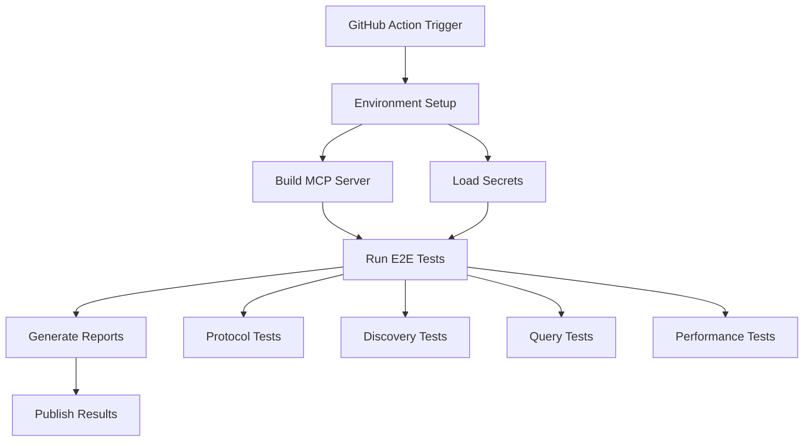

# E2E Test Pipeline

This document describes the automated end-to-end testing pipeline for the MCP Server New Relic project.

## Overview

The E2E test pipeline validates the MCP server functionality against real New Relic APIs, ensuring that all tools work correctly with actual data.

## Pipeline Architecture



## GitHub Actions Workflow

Create `.github/workflows/e2e-tests.yml`:

```yaml
name: E2E Tests

on:
  push:
    branches: [ main, develop ]
  pull_request:
    branches: [ main ]
  schedule:
    # Run nightly at 2 AM UTC
    - cron: '0 2 * * *'
  workflow_dispatch:

jobs:
  e2e-tests:
    runs-on: ubuntu-latest
    timeout-minutes: 30
    
    steps:
    - uses: actions/checkout@v3
    
    - name: Set up Go
      uses: actions/setup-go@v4
      with:
        go-version: '1.21'
    
    - name: Cache Go modules
      uses: actions/cache@v3
      with:
        path: ~/go/pkg/mod
        key: ${{ runner.os }}-go-${{ hashFiles('**/go.sum') }}
        restore-keys: |
          ${{ runner.os }}-go-
    
    - name: Install dependencies
      run: |
        go mod download
        go mod verify
    
    - name: Build MCP Server
      run: make build-mcp
    
    - name: Create test environment file
      env:
        NR_API_KEY: ${{ secrets.NR_API_KEY }}
        NR_ACCOUNT_ID: ${{ secrets.NR_ACCOUNT_ID }}
        NR_USER_KEY: ${{ secrets.NR_USER_KEY }}
        NR_REGION: ${{ secrets.NR_REGION }}
      run: |
        cat > .env.test <<EOF
        NEW_RELIC_API_KEY=$NR_API_KEY
        NEW_RELIC_ACCOUNT_ID=$NR_ACCOUNT_ID
        NEW_RELIC_USER_KEY=$NR_USER_KEY
        NEW_RELIC_REGION=$NR_REGION
        EOF
    
    - name: Run E2E Tests
      run: |
        go test -v -timeout 20m ./tests/e2e/... \
          -run '^Test(MCPProtocolCompliance|DiscoveryChain|AdaptiveQueryBuilding)$' \
          2>&1 | tee e2e-test-results.log
    
    - name: Run Performance Benchmarks
      if: github.event_name == 'schedule' || github.event_name == 'workflow_dispatch'
      run: |
        go test -v -timeout 15m ./tests/e2e/... \
          -run '^TestPerformanceBenchmarks$' \
          2>&1 | tee benchmark-results.log
    
    - name: Upload test results
      if: always()
      uses: actions/upload-artifact@v3
      with:
        name: test-results
        path: |
          e2e-test-results.log
          benchmark-results.log
    
    - name: Generate test report
      if: always()
      run: |
        go install github.com/jstemmer/go-junit-report/v2@latest
        cat e2e-test-results.log | go-junit-report -set-exit-code > e2e-test-report.xml
    
    - name: Publish test results
      if: always()
      uses: EnricoMi/publish-unit-test-result-action@v2
      with:
        files: |
          e2e-test-report.xml
    
    - name: Comment PR with results
      if: github.event_name == 'pull_request' && always()
      uses: actions/github-script@v6
      with:
        script: |
          const fs = require('fs');
          const testLog = fs.readFileSync('e2e-test-results.log', 'utf8');
          const passed = testLog.includes('PASS');
          const failed = testLog.includes('FAIL');
          
          let status = '✅ E2E Tests Passed';
          if (failed) {
            status = '❌ E2E Tests Failed';
          }
          
          const summary = testLog.match(/PASS|FAIL/g) || [];
          const passCount = summary.filter(s => s === 'PASS').length;
          const failCount = summary.filter(s => s === 'FAIL').length;
          
          const comment = `## E2E Test Results
          
          ${status}
          
          - ✅ Passed: ${passCount}
          - ❌ Failed: ${failCount}
          
          <details>
          <summary>View Details</summary>
          
          \`\`\`
          ${testLog.slice(-2000)}
          \`\`\`
          </details>`;
          
          github.rest.issues.createComment({
            issue_number: context.issue.number,
            owner: context.repo.owner,
            repo: context.repo.repo,
            body: comment
          });
```

## Local Development Pipeline

### Running E2E Tests Locally

```bash
# 1. Set up environment
cp .env.example .env.test
# Edit .env.test with your New Relic credentials

# 2. Build the server
make build-mcp

# 3. Run all E2E tests
make test-e2e

# 4. Run specific test suites
go test -v ./tests/e2e -run TestMCPProtocolCompliance
go test -v ./tests/e2e -run TestDiscoveryChain
go test -v ./tests/e2e -run TestPerformanceBenchmarks

# 5. Run with coverage
go test -v -coverprofile=coverage.out ./tests/e2e/...
go tool cover -html=coverage.out -o coverage.html
```

### Makefile Targets

Add to `Makefile.e2e`:

```makefile
.PHONY: test-e2e
test-e2e: build-mcp
	@echo "Running E2E tests..."
	@go test -v -timeout 20m ./tests/e2e/... \
		-run '^Test(MCPProtocolCompliance|DiscoveryChain|AdaptiveQueryBuilding|ComposableTools)$$'

.PHONY: test-e2e-benchmark
test-e2e-benchmark: build-mcp
	@echo "Running E2E performance benchmarks..."
	@go test -v -timeout 15m ./tests/e2e/... \
		-run '^TestPerformanceBenchmarks$$'

.PHONY: test-e2e-all
test-e2e-all: test-e2e test-e2e-benchmark

.PHONY: test-e2e-coverage
test-e2e-coverage: build-mcp
	@echo "Running E2E tests with coverage..."
	@go test -v -coverprofile=e2e-coverage.out -timeout 20m ./tests/e2e/...
	@go tool cover -html=e2e-coverage.out -o e2e-coverage.html
	@echo "Coverage report generated: e2e-coverage.html"
```

## Test Data Management

### Test Account Structure

```yaml
# tests/e2e/testdata/accounts.yml
accounts:
  primary:
    account_id: "${NR_ACCOUNT_ID}"
    region: "${NR_REGION}"
    description: "Primary test account with standard data"
  
  secondary:
    account_id: "${NR_ACCOUNT_ID_2}"
    region: "${NR_REGION}"
    description: "Secondary account for multi-account tests"
```

### Mock Data for CI

When running in CI without real credentials:

```go
// tests/e2e/framework/mock_mode.go
func (c *MCPTestClient) EnableMockMode() {
    c.mockMode = true
    c.mockResponses = loadMockResponses()
}
```

## Performance Baselines

### Expected Performance Metrics

| Tool | P95 Latency | Error Rate | Notes |
|------|-------------|------------|-------|
| discovery.explore_event_types | < 3s | < 1% | Simple query |
| discovery.explore_attributes | < 5s | < 2% | Multiple queries |
| query_nrdb (simple) | < 2s | < 1% | Basic count query |
| query_nrdb (complex) | < 5s | < 2% | Faceted with percentiles |
| query_builder | < 100ms | < 0.1% | Local operation |

### Performance Regression Detection

```yaml
# .github/workflows/performance-check.yml
- name: Check Performance Regression
  run: |
    # Compare against baseline
    go run ./tests/e2e/cmd/perf-check \
      -baseline ./tests/e2e/testdata/perf-baseline.json \
      -results ./benchmark-results.json \
      -threshold 20  # Alert if 20% slower
```

## Monitoring & Alerts

### Slack Notifications

```yaml
- name: Notify Slack on Failure
  if: failure()
  uses: 8398a7/action-slack@v3
  with:
    status: ${{ job.status }}
    text: 'E2E tests failed on ${{ github.ref }}'
    webhook_url: ${{ secrets.SLACK_WEBHOOK }}
```

### Dashboard Integration

Send test results to New Relic:

```go
// tests/e2e/framework/reporting.go
func ReportToNewRelic(results []TestResult) error {
    client := newrelic.NewClient(os.Getenv("NR_INSIGHTS_KEY"))
    
    events := make([]newrelic.Event, len(results))
    for i, r := range results {
        events[i] = newrelic.Event{
            EventType: "MCPServerE2ETest",
            Timestamp: time.Now().Unix(),
            Attributes: map[string]interface{}{
                "testName":    r.Name,
                "duration":    r.Duration.Milliseconds(),
                "passed":      r.Passed,
                "error":       r.Error,
                "environment": os.Getenv("TEST_ENV"),
            },
        }
    }
    
    return client.SendEvents(events)
}
```

## Troubleshooting

### Common Issues

1. **Rate Limiting**
   - Add delays between API calls
   - Use separate test accounts
   - Implement exponential backoff

2. **Timeout Errors**
   - Increase test timeouts for slow queries
   - Check New Relic API status
   - Verify network connectivity

3. **Authentication Failures**
   - Verify API keys are valid
   - Check account permissions
   - Ensure correct region setting

### Debug Mode

```bash
# Enable verbose logging
export MCP_DEBUG=true
export LOG_LEVEL=DEBUG

# Run with detailed output
go test -v ./tests/e2e -run TestName -args -debug
```

## Best Practices

1. **Test Isolation**
   - Each test should be independent
   - Clean up created resources
   - Use unique identifiers

2. **Error Handling**
   - Always check for errors
   - Provide meaningful error messages
   - Include context in failures

3. **Performance**
   - Run expensive tests selectively
   - Use test caching where appropriate
   - Parallelize independent tests

4. **Security**
   - Never commit credentials
   - Use GitHub secrets for CI
   - Rotate test API keys regularly

## Future Enhancements

1. **Parallel Execution**
   - Run test suites in parallel
   - Distribute across multiple accounts
   - Reduce overall test time

2. **Visual Regression Testing**
   - Capture dashboard screenshots
   - Compare against baselines
   - Alert on visual changes

3. **Chaos Testing**
   - Simulate API failures
   - Test retry mechanisms
   - Validate error handling

4. **Load Testing**
   - Simulate concurrent users
   - Measure scalability limits
   - Identify bottlenecks