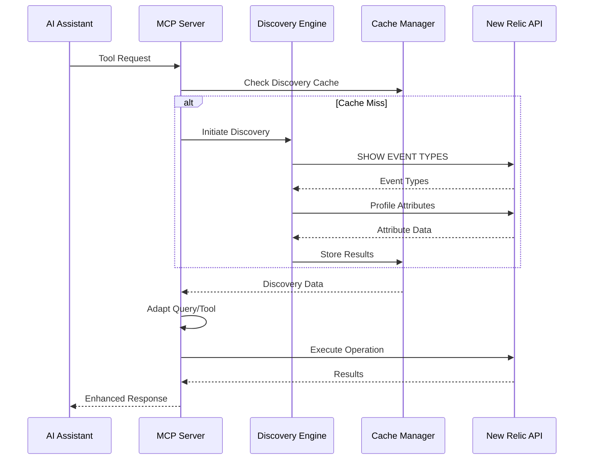

# MCP Server New Relic: Technical Specification

## Document Information
- **Version**: 2.0.0
- **Status**: Draft
- **Created**: 2025-06-22
- **Architecture Type**: Platform-Native, Schema-Agnostic

## Table of Contents
1. [Executive Summary](#executive-summary)
2. [System Overview](#system-overview)
3. [Architecture Design](#architecture-design)
4. [Core Components](#core-components)
5. [API Specifications](#api-specifications)
6. [Data Models](#data-models)
7. [Security & Performance](#security--performance)
8. [Implementation Plan](#implementation-plan)
9. [Testing Strategy](#testing-strategy)
10. [Deployment & Operations](#deployment--operations)

## Executive Summary

### Purpose
The MCP Server New Relic is an internal Model Context Protocol (MCP) server designed for comprehensive New Relic platform analysis and governance. It provides AI assistants with intelligent, adaptive access to New Relic data through dynamic schema discovery and platform-native operations.

### Key Innovations
- **Zero Hardcoded Schemas**: All schemas, fields, and relationships discovered at runtime
- **Adaptive Intelligence**: Tools automatically adapt to discovered data structures
- **Platform-Native Design**: Deep integration with NerdGraph, NRQL, and entity models
- **AI-Optimized**: Rich metadata and examples for effective LLM orchestration

### Target Users
- AI assistants (Claude, GPT, etc.) for automated platform analysis
- Internal teams requiring programmatic New Relic access
- Platform governance and compliance automation

## System Overview

### High-Level Architecture

```
┌─────────────────────────────────────────────┐
│          AI Assistant (LLM)                 │
│    (Claude, GPT, Internal Assistants)       │
└────────────────┬────────────────────────────┘
                 │ MCP Protocol
                 │ (JSON-RPC 2.0)
┌────────────────▼────────────────────────────┐
│         MCP Server New Relic                │
├─────────────────────────────────────────────┤
│  ┌─────────────────────────────────────┐   │
│  │     Tool Enhancement Layer          │   │
│  │  - Rich metadata & examples         │   │
│  │  - Parameter validation             │   │
│  │  - Error handling & suggestions     │   │
│  └─────────────────────────────────────┘   │
│  ┌─────────────────────────────────────┐   │
│  │    Platform Discovery Engine        │   │
│  │  - Schema discovery                 │   │
│  │  - Attribute profiling              │   │
│  │  - Metric/event detection           │   │
│  └─────────────────────────────────────┘   │
│  ┌─────────────────────────────────────┐   │
│  │    Adaptive Generation Engine       │   │
│  │  - Dashboard templates              │   │
│  │  - Query adaptation                 │   │
│  │  - Widget composition               │   │
│  └─────────────────────────────────────┘   │
│  ┌─────────────────────────────────────┐   │
│  │      Cache & State Manager          │   │
│  │  - Discovery cache                  │   │
│  │  - Session state                    │   │
│  │  - Rate limiting                    │   │
│  └─────────────────────────────────────┘   │
└────────────────┬────────────────────────────┘
                 │ GraphQL/HTTPS
                 ▼
         New Relic NerdGraph API

```

### Core Design Principles

1. **Schema Agnosticism**: No assumptions about data structures
2. **Runtime Discovery**: All metadata discovered dynamically
3. **Graceful Adaptation**: Automatically adjust to available fields
4. **Safety by Default**: Destructive operations require confirmation
5. **Performance Optimized**: Intelligent caching and batching

## Architecture Design

### Component Architecture

```typescript
// Component structure
src/
├── index.ts                 // MCP server entry point
├── core/
│   ├── discovery.ts        // Platform discovery engine
│   ├── cache.ts           // Caching layer
│   ├── nerdgraph.ts       // NerdGraph client
│   └── types.ts           // Core type definitions
├── tools/
│   ├── registry.ts        // Tool registration
│   ├── enhance-existing.ts // Enhancement layer
│   ├── dashboards.ts      // Dashboard tools
│   ├── discovery.ts       // Discovery tools
│   └── platform.ts        // Platform analysis
├── adapters/
│   ├── widget-adapter.ts  // Widget adaptation
│   ├── query-adapter.ts   // Query adaptation
│   └── schema-mapper.ts   // Schema mapping
└── utils/
    ├── validation.ts      // Input validation
    ├── errors.ts         // Error handling
    └── logger.ts         // Logging utilities
```

### Data Flow



## Core Components

### 1. Platform Discovery Engine

The discovery engine dynamically learns platform structure without hardcoded assumptions.

#### Key Features
- Event type discovery with sample counts
- Attribute profiling (type, cardinality, usage)
- Metric dimension detection
- Entity relationship mapping

#### Discovery Methods

```typescript
interface DiscoveryEngine {
  // Core discovery methods
  discoverEventTypes(accountId: number): Promise<EventType[]>
  discoverAttributes(accountId: number, eventType: string): Promise<Attribute[]>
  discoverMetrics(accountId: number): Promise<MetricInfo[]>
  discoverEntities(accountId: number): Promise<EntityInfo[]>
  
  // Advanced profiling
  profileAttribute(accountId: number, eventType: string, attribute: string): Promise<AttributeProfile>
  detectRelationships(accountId: number, entityGuid: string): Promise<Relationship[]>
  analyzeDataQuality(accountId: number, eventType: string): Promise<DataQuality>
}

interface AttributeProfile {
  name: string
  type: 'string' | 'numeric' | 'boolean' | 'timestamp'
  cardinality: number
  nullPercentage: number
  sampleValues: any[]
  isIdentifier: boolean
  isDimension: boolean
  isMetric: boolean
}
```

### 2. Tool Enhancement Layer

Enriches existing tools with metadata for AI consumption.

#### Enhancement Structure

```typescript
interface ToolEnhancement {
  description: string          // Rich, AI-friendly description
  inputSchema: JSONSchema      // Detailed parameter schema
  outputSchema: JSONSchema     // Expected output structure
  examples: Example[]          // Usage examples
  metadata: ToolMetadata       // Additional hints
  handler?: HandlerWrapper     // Optional handler wrapper
}

interface ToolMetadata {
  category: 'query' | 'discovery' | 'action' | 'analysis'
  readOnlyHint: boolean
  destructiveHint: boolean
  costIndicator: 'low' | 'medium' | 'high'
  requiresConfirmation: boolean
  returnsNextCursor: boolean
}
```

### 3. Adaptive Generation Engine

Creates dashboards and queries that adapt to discovered schemas.

#### Template System

```typescript
interface DashboardTemplate {
  name: string
  description: string
  widgets: TemplateWidget[]
  variables: TemplateVariable[]
}

interface TemplateWidget {
  intent: WidgetIntent
  title: string
  visualization: string
  fallbackStrategies: FallbackStrategy[]
}

type WidgetIntent = 
  | 'error_rate'
  | 'latency'
  | 'throughput'
  | 'saturation'
  | 'dependencies'
  | 'logs_analysis'
  | 'custom'

interface FallbackStrategy {
  condition: (discovery: Discovery) => boolean
  adapt: (widget: Widget, discovery: Discovery) => Widget
}
```

## API Specifications

### Tool Definitions

#### 1. discover_schemas

```typescript
{
  name: 'discover_schemas',
  description: 'Discover all available event types and attributes',
  inputSchema: {
    type: 'object',
    properties: {
      account_id: { type: 'number', description: 'New Relic account ID' },
      include_attributes: { type: 'boolean', default: false },
      include_metrics: { type: 'boolean', default: true },
      time_range: { type: 'string', default: '1 hour ago' }
    },
    required: ['account_id']
  },
  outputSchema: {
    type: 'object',
    properties: {
      event_types: {
        type: 'array',
        items: {
          type: 'object',
          properties: {
            name: { type: 'string' },
            sample_count: { type: 'number' },
            attributes: { type: 'array' }
          }
        }
      },
      metrics: { type: 'array' },
      summary: { type: 'object' }
    }
  }
}
```

#### 2. dashboard_generate

```typescript
{
  name: 'dashboard_generate',
  description: 'Generate adaptive dashboards from templates',
  inputSchema: {
    type: 'object',
    properties: {
      template_name: {
        type: 'string',
        enum: ['golden-signals', 'dependencies', 'infrastructure', 'logs-analysis', 'custom']
      },
      entity_guid: { type: 'string' },
      dashboard_name: { type: 'string' },
      time_range: { type: 'string', default: '1 hour ago' },
      dry_run: { type: 'boolean', default: true }
    },
    required: ['template_name', 'entity_guid']
  }
}
```

#### 3. platform_analyze_adoption

```typescript
{
  name: 'platform_analyze_adoption',
  description: 'Analyze platform adoption across accounts',
  inputSchema: {
    type: 'object',
    properties: {
      account_ids: { type: 'array', items: { type: 'number' } },
      metrics: {
        type: 'array',
        items: {
          type: 'string',
          enum: ['dimensional_metrics', 'opentelemetry', 'entity_synthesis', 'dashboards']
        }
      }
    },
    required: ['account_ids', 'metrics']
  }
}
```

## Data Models

### Core Entities

```typescript
// Discovery Results
interface EventType {
  name: string
  sampleCount: number
  attributes: Attribute[]
  firstSeen: Date
  lastSeen: Date
  avgRecordSize: number
}

interface Attribute {
  name: string
  type: AttributeType
  cardinality: number
  isNumeric: boolean
  isDimension: boolean
  isRequired: boolean
  sampleValues: any[]
}

// Platform Entities
interface Entity {
  guid: string
  name: string
  type: string
  domain: EntityDomain
  accountId: number
  tags: Tag[]
  goldenMetrics: GoldenMetrics
  relationships: Relationship[]
}

interface GoldenMetrics {
  throughput?: MetricValue
  errorRate?: MetricValue
  latency?: MetricValue
  saturation?: MetricValue
}

// Dashboard Models
interface Dashboard {
  guid?: string
  name: string
  description?: string
  permissions: 'PUBLIC' | 'PRIVATE'
  pages: DashboardPage[]
  variables: DashboardVariable[]
}

interface Widget {
  title: string
  visualization: { id: string }
  configuration: WidgetConfiguration
  layout: WidgetLayout
}
```

### Cache Models

```typescript
interface CacheEntry<T> {
  key: string
  value: T
  timestamp: Date
  ttl: number
  accountId?: number
  entityGuid?: string
}

interface DiscoveryCache {
  eventTypes: Map<string, CacheEntry<EventType[]>>
  attributes: Map<string, CacheEntry<Attribute[]>>
  metrics: Map<string, CacheEntry<MetricInfo[]>>
  entities: Map<string, CacheEntry<Entity>>
}
```

## Security & Performance

### Security Considerations

1. **Authentication & Authorization**
   - API key validation on every request
   - Account-level access control
   - Operation-level permissions

2. **Data Protection**
   - No credentials in logs or errors
   - Sanitized error messages
   - Encrypted cache storage

3. **Rate Limiting**
   - Per-account rate limits
   - Backoff strategies
   - Circuit breaker patterns

### Performance Optimizations

1. **Caching Strategy**
   - Multi-level cache (memory + persistent)
   - TTL-based invalidation
   - Cache warming for common queries

2. **Query Optimization**
   - Batch discovery operations
   - Parallel attribute profiling
   - Lazy loading for large datasets

3. **Resource Management**
   - Connection pooling
   - Timeout management
   - Memory limits for cache

## Implementation Plan

### Phase 1: Foundation (Week 1)
- [ ] Core MCP server setup
- [ ] Basic tool enhancement framework
- [ ] NerdGraph client implementation
- [ ] Error handling and logging

### Phase 2: Discovery Engine (Week 2-3)
- [ ] Event type discovery
- [ ] Attribute profiling
- [ ] Metric discovery
- [ ] Caching layer

### Phase 3: Tool Enhancement (Week 3-4)
- [ ] Enhance existing query tools
- [ ] Add rich metadata
- [ ] Implement examples
- [ ] Parameter validation

### Phase 4: Dashboard Generation (Week 4-5)
- [ ] Template system
- [ ] Widget adaptation
- [ ] Dry-run capability
- [ ] Preview generation

### Phase 5: Platform Intelligence (Week 5-6)
- [ ] Cross-account analysis
- [ ] Adoption metrics
- [ ] Migration tools
- [ ] Performance analysis

### Phase 6: Production Readiness (Week 6-7)
- [ ] Comprehensive testing
- [ ] Performance tuning
- [ ] Documentation
- [ ] Deployment automation

## Testing Strategy

### Unit Testing
- Component isolation tests
- Mock NerdGraph responses
- Edge case coverage
- Error scenario testing

### Integration Testing
- End-to-end tool flows
- Real API integration
- Multi-account scenarios
- Performance benchmarks

### Test Coverage Goals
- Overall: 85%+
- Core components: 95%+
- Critical paths: 100%

## Deployment & Operations

### Deployment Architecture

```yaml
# Kubernetes deployment
apiVersion: apps/v1
kind: Deployment
metadata:
  name: mcp-server-newrelic
spec:
  replicas: 3
  template:
    spec:
      containers:
      - name: mcp-server
        image: mcp-server-newrelic:2.0.0
        env:
        - name: LOG_LEVEL
          value: "INFO"
        - name: CACHE_TYPE
          value: "redis"
        resources:
          requests:
            memory: "512Mi"
            cpu: "500m"
          limits:
            memory: "2Gi"
            cpu: "2000m"
```

### Monitoring & Observability

1. **Metrics**
   - Request latency
   - Discovery cache hit rate
   - API error rates
   - Resource utilization

2. **Logging**
   - Structured JSON logs
   - Correlation IDs
   - Performance traces
   - Audit trails

3. **Alerting**
   - API availability
   - Error rate thresholds
   - Performance degradation
   - Cache failures

### Operational Procedures

1. **Cache Management**
   - Manual invalidation endpoints
   - Scheduled cleanup
   - Size monitoring

2. **Performance Tuning**
   - Discovery batch sizes
   - Concurrent operation limits
   - Timeout adjustments

3. **Troubleshooting Guide**
   - Common error patterns
   - Debug procedures
   - Recovery steps

## Success Metrics

### Technical Metrics
- **Schema Discovery Coverage**: 100% of available event types
- **Adaptation Success Rate**: >95% of generated queries work first try
- **Cache Hit Rate**: >80% for discovery operations
- **Response Time**: <2s for discovery, <5s for generation

### Business Metrics
- **AI Task Success Rate**: >90% multi-step completion
- **Cross-Account Scale**: Support 1000+ accounts
- **User Adoption**: 50% of eligible teams within 6 months
- **Cost Reduction**: 30% reduction in manual platform analysis

## Appendices

### A. Error Codes

| Code | Description | Resolution |
|------|-------------|------------|
| DISC-001 | Discovery timeout | Reduce time range or retry |
| DISC-002 | No data found | Verify account has data |
| ADAPT-001 | No suitable field found | Check schema compatibility |
| CACHE-001 | Cache unavailable | Falls back to direct query |

### B. Example Workflows

#### Workflow 1: New Account Onboarding
1. Run `discover_schemas` to understand data landscape
2. Use `search_entities` to find key services
3. Generate dashboards with `dashboard_generate`
4. Analyze adoption with `platform_analyze_adoption`

#### Workflow 2: Incident Investigation
1. Search for affected entity
2. Get entity details including relationships
3. Run adaptive queries for error analysis
4. Generate incident dashboard

### C. Glossary

- **MCP**: Model Context Protocol
- **NerdGraph**: New Relic's GraphQL API
- **NRQL**: New Relic Query Language
- **Entity**: Core object in New Relic that emits telemetry
- **Golden Signals**: Latency, traffic, errors, saturation
- **Dimensional Metrics**: Metrics with attributes/dimensions

---

This technical specification provides a comprehensive blueprint for implementing the MCP Server New Relic with its revolutionary schema-agnostic, discovery-first approach to platform analysis and governance.